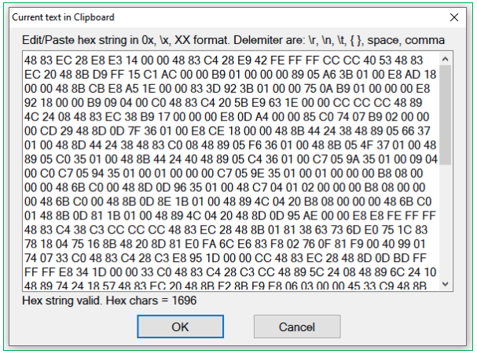

# a plugin to able to paste the string formatted binary/shellcode data into the x64dbg. 

you can use

c style byte array,
***{0x90, 0x90, 0x90};***

c style shellcode,
***"\x90\x90\x90"***

or sequence of a hex numbers.

***AA BB CC DD EE FF***

or

***AABBCCDDEEFF***

***installation*** 💾
drop the plugin binary into x64dbg's plugin directory.
use dp32 for 32, dp64 for 64 bit of the debugger.

***usage*** ⌨
just copy the text and paste it using yummyPaste's right-click menu.
you can paste either to the disassembler or the dump window.

Original code:
[yummyPaste](https://github.com/0ffffffffh/yummyPaste)

## Mod:

### By HTC (TQN)

- Add dialog so users can preview, edit hex content in clipboar
- By default, each character in the string is hex char, no more parsing in decimal
- Hex string can copy/paste from another hex editors, IDA, shellcode, or right in x64dbg (binary copy)...

### Build

Build with Visual Studio >= 2017

1. Edit file x64dbg.props, change value of <X64DBG_DIR> and <X64SDK_DIR> to path of your install x64dbg and pluginsdk

2. Open yummyPaste.sln and build
